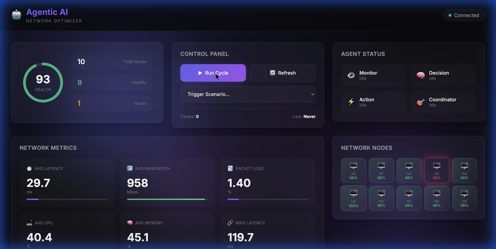

# 🤖 Agentic AI for Autonomous Network Optimization

A multi-agent AI system for autonomous network monitoring and optimization using LLM-powered decision making.



## 🌐 Live Demo

> **Run locally:** The system runs a local web server with a beautiful dashboard at `http://localhost:8000`

```bash
# Quick Start
git clone https://github.com/Ayan113/Agentic-AI-for-Autonomous-Network-Optimization.git
cd Agentic-AI-for-Autonomous-Network-Optimization
python -m venv venv
source venv/bin/activate  # Windows: venv\Scripts\activate
pip install -r requirements.txt
python run.py api
# Open http://localhost:8000 in your browser
```

---


## 🌟 Features

- **Multi-Agent Architecture**: Four specialized agents working in coordination
  - **Monitor Agent**: Collects network metrics, detects anomalies
  - **Decision Agent**: LLM-powered analysis and decision making
  - **Action Agent**: Executes corrective actions
  - **Coordinator**: Orchestrates the Monitor → Decide → Act loop

- **Modern Web Dashboard**: Real-time visualization with glassmorphism UI
- **LLM-Based Decision Making**: Uses GPT-4 or mock provider for intelligent analysis
- **Network Simulation**: Built-in simulator with configurable events and scenarios
- **Feedback Loop**: Learns from action outcomes to improve future decisions
- **REST API**: Full control via HTTP endpoints

## 🏗️ Architecture

```
┌─────────────────────────────────────────────────────────────┐
│                     COORDINATOR                              │
│   ┌──────────┐    ┌──────────┐    ┌──────────┐              │
│   │ MONITOR  │───▶│ DECISION │───▶│  ACTION  │              │
│   │  AGENT   │    │  AGENT   │    │  AGENT   │              │
│   └──────────┘    └──────────┘    └──────────┘              │
│        │              │    ▲           │                     │
│        ▼              ▼    │           ▼                     │
│   ┌──────────┐    ┌──────────┐    ┌──────────┐              │
│   │ NETWORK  │    │   LLM    │    │ FEEDBACK │              │
│   │SIMULATOR │    │ PROVIDER │    │   LOOP   │              │
│   └──────────┘    └──────────┘    └──────────┘              │
└─────────────────────────────────────────────────────────────┘
```

## 🚀 Quick Start

### Installation

```bash
# Clone the repository
git clone https://github.com/Ayan113/Agentic-AI-for-Autonomous-Network-Optimization.git
cd Agentic-AI-for-Autonomous-Network-Optimization

# Create virtual environment
python -m venv venv
source venv/bin/activate  # On Windows: venv\Scripts\activate

# Install dependencies
pip install -r requirements.txt
```

### Running the System

**Web Dashboard** (Recommended):
```bash
python run.py api --port 8000
# Open http://localhost:8000 in your browser
```

**Demo Mode** - Run a single optimization cycle:
```bash
python run.py demo
```

**Continuous Monitoring**:
```bash
python run.py monitor --interval 10 --cycles 5
```

## 🎮 Dashboard Features

| Feature | Description |
|---------|-------------|
| **Health Ring** | Real-time network health score (0-100) |
| **Agent Status** | Live status of all 4 agents |
| **Network Metrics** | Latency, bandwidth, packet loss, CPU, memory |
| **Node Grid** | Visual health status of all network nodes |
| **Run Cycle** | Trigger optimization on demand |
| **Scenarios** | Simulate network issues (outage, high traffic, etc.) |

## 📊 API Endpoints

| Endpoint | Method | Description |
|----------|--------|-------------|
| `/` | GET | Dashboard UI |
| `/status` | GET | System and agent status |
| `/metrics` | GET | Current network metrics |
| `/decisions` | GET | Decision history |
| `/cycle` | POST | Run optimization cycle |
| `/simulate` | POST | Trigger network scenario |
| `/docs` | GET | Interactive API documentation |

## ⚙️ Configuration

Edit `config.yaml` to customize:

```yaml
llm:
  provider: "mock"  # Options: "openai", "mock"
  model: "gpt-4o-mini"
  
network:
  simulation:
    enabled: true
    nodes: 10
    event_probability: 0.3

agents:
  monitor:
    polling_interval: 5
  decision:
    confidence_threshold: 0.7
```

### Using OpenAI

```bash
export OPENAI_API_KEY="your-api-key"
# Then update config.yaml: provider: "openai"
```

## 📁 Project Structure

```
├── src/
│   ├── agents/           # AI Agents
│   │   ├── base_agent.py
│   │   ├── monitor_agent.py
│   │   ├── decision_agent.py
│   │   ├── action_agent.py
│   │   └── coordinator.py
│   ├── network/          # Network simulation
│   ├── llm/              # LLM integration
│   ├── feedback/         # Learning system
│   └── api/              # REST API
├── frontend/             # Web dashboard
│   ├── index.html
│   ├── styles.css
│   └── app.js
├── config.yaml           # Configuration
├── run.py               # Entry point
└── requirements.txt     # Dependencies
```

## 🔧 Available Actions

The system can execute these corrective actions:

| Action | Description |
|--------|-------------|
| `optimize_routing` | Optimize network paths |
| `reduce_traffic` | Throttle congested traffic |
| `load_balance` | Redistribute load |
| `clear_cache` | Free memory |
| `restart_service` | Restart problematic services |
| `scale_up/down` | Add/remove instances |

## 📈 Performance

Tested results from demo:
- Health improvement: **93 → 97** (+4 points)
- Latency reduction: **29.7ms → 20.1ms** (-32%)
- Packet loss reduction: **1.40% → 0.39%** (-72%)

## 🤝 Contributing

Contributions welcome! Please feel free to submit a Pull Request.

## 📄 License

MIT License - feel free to use and modify for your projects.

## 👨‍💻 Author

**Ayan Chatterjee**
- GitHub: [@Ayan113](https://github.com/Ayan113)
